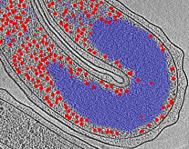

mrc_simple_filter
===========

This is a collection of programs (mainly "filter_mrc" and "combine_mrc") for 3-D image processing using the MRC file format.

## programs included with this repository:

After compilation, all programs will be located in the "*bin/*" subdirectory.  Here is a brief description of each:

## filter_mrc

**filter_mrc** can be used for 3D
[scale-free blob-detection](https://en.wikipedia.org/wiki/Blob_detection), 
smoothing, edge detection, low-pass, high-pass, band-pass filters, brightness-fluctuation,
thresholding, inversions, minima-finding, and
[template-matching](https://en.wikipedia.org/wiki/Template_matching)
(of spherical objects) in tomograms.
A list of detected objects can be saved to a text file.
Processed or annotated images can be saved to a new MRC/REC file.
(Fast [separable](https://en.wikipedia.org/wiki/Separable_filter) filters are used whenever possible.)
As shown in the example above, certain voxels or regions can be excluded from consideration (using the "-mask" argument).
Documentation for this program is located
[here](./doc/doc_filter_mrc.md).

## combine_mrc
**combine_mrc** is a program for combining two volumetric images (i.e. tomograms, both of identical size) into one image/tomogram, using a combination of addition, multiplication, and thresholding operations.  These features can be used perform binary operations between two images (which are similar to "**and**" and "**or**" operations.  "**not**" operations are also possible.)  As with the "*filter_mrc*" program, you can also use the "-mask" argument to restrict the operation to certain voxels from the image.  (See the documentation for that tool for details.)
Documentation for this program is located
[here](./doc/doc_combine_mrc.md).

## histogram_mrc.py
**histogram_mrc.py** is a graphical python program which displays the
histogram of voxel intensities contained in an MRC file.
It can be useful when deciding what thresholds to use
with in the "**filter_mrc**" and "**combine_mrc**" programs.
This software requires the *matplotlib* and *mrcfile* python modules
(both of which can be installed using pip).
Documentation for this program is located
[here](./doc/doc_histogram_mrc.md).

## sum_voxels
**sum_voxels** is a simple program which
reads an MRC (.REC) file as an argument
and computes the sum of all the voxel intensities.
(Typically the voxel intensities are either 1 or 0.
 The resulting sums can be converted into volumes by
 multiplying by the volume-per-voxel.)
For convenience, the voxel intensities can be clipped or scaled
between 0 and 1 beforehand
(by using the "-thresh", "-thresh2", and "-thresh4" arguments),
and the sum can be restricted to certain regions
(by using the "-mask" and "-mask-select" arguments).

## Development Status: *alpha*
As of 2018-4-30, this code has been lightly tested.
Program names and command line
arguments may change in the future.
Tagged *releases* of this repository should have some semblance
of functionality.  (More recent commits may not even compile.)

## Compilation

## Linux:

    cd src
    source setup_gcc_linux.sh
    make

(If you are not using the bash shell, enter "bash" into the terminal beforehand)

## Windows 10:

Install the Windows Subsystem for Linux (WSL) and run

    sudo apt-get install build-essential

and then follow the instructions above for linux.
(Older windows users can install Cygwin or MinGW.)

## Apple OSX:

    cd src
    source setup_gcc_OSX.sh
    make

## Requirements:

The optional "draw_filter_1D.py" script
(included in the "bin/filter_mrc" directory)
requires python, numpy, and matplotlib.
(It is useful only if you actually want to see
 the shape of the convolution filter that is currently in use.
 Most users can ignore this.)

## License

These programs are available under the terms of the open-source 3-clause BSD
license.  (See `LICENSE.md`.)
