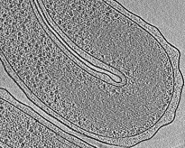

[]

mrc_simple_filter
===========

This is a C++ template library for 3D image processing
("[filter3d.h](./lib/filter/filter3d.h)")
as well as reading & writing image files using the the MRC file format
("[mrc_simple.h](./lib/mrc_simple/mrc_simple.h)").
It is also a collection of stand-alone programs 
(mainly "[filter_mrc](./doc/doc_filter_mrc.md)" and
 "[combine_mrc](./doc/doc_combine_mrc.md))")
which use this library.
Multiprocessor support is implemented using OpenMP.

## programs included with this repository:

After compilation, all programs will be located in the "*bin/*" subdirectory.  Here is a brief description of some of them:

## filter_mrc

**filter_mrc** detects features and applies simple filters to 3D images.
It supports 
[3D scale-free blob-detection](https://en.wikipedia.org/wiki/Blob_detection),
and local minima/maxima finding (with non-max suppresion).
Filters include
thresholding,
low-pass, high-pass, 
[generalized](https://en.wikipedia.org/wiki/Generalized_normal_distribution#Version_1)
[Gaussian](https://en.wikipedia.org/wiki/Gaussian_blur),
and
[DOG](https://en.wikipedia.org/wiki/Difference_of_Gaussians)
filters, and others.
A image *mask* can be used to exclude certain
voxels or regions from consideration.
(Typically these are voxels which have been characterized previously.)
A list of detected objects can be saved to a text file.
Annotated images can be saved to a new MRC/REC file.
Documentation for this program is located
[here](./doc/doc_filter_mrc.md).
The *source code* for the filters used by this program
is located here
[here](./lib/filter/filter3d.h).
(Doxygen comments are used throughout.)

## combine_mrc
**combine_mrc** is a program for combining two volumetric images (i.e. tomograms, both of identical size) into one image/tomogram, using a combination of addition, multiplication, and thresholding operations.  These features can be used perform binary operations between two images (which are similar to "**and**", "**or**", and "**not**" operations.)
Documentation for this program is located
[here](./doc/doc_combine_mrc.md).

## histogram_mrc.py
**histogram_mrc.py** is a graphical python program which displays the
histogram of voxel intensities contained in an MRC file.
It can be useful when deciding what thresholds to use
with in the "**filter_mrc**" and "**combine_mrc**" programs.
Voxels and regions in the image can be excluded from consideration 
by using the "-mask" and "-mask-select" arguments.
This software requires the *matplotlib* and *mrcfile* python modules
(both of which can be installed using pip).
Documentation for this program is located
[here](./doc/doc_histogram_mrc.md).

## sum_voxels
**sum_voxels** is a program for estimating volumes.
It is a simple program which
reads an MRC (.REC) file as an argument
and computes the sum of all the voxel intensities.
(Typically the voxel intensities are either 1 or 0.
 The resulting sums can be converted into volumes
 either by multiplying by the volume-per-voxel,
 or by specifying the voxel width using the "-w" argument.)
For convenience, threshold operation can be applied
(using the "-thresh", "-thresh2", and "-thresh4" arguments)
so that the voxels intensities vary between 0 and 1
before the sum is calculated.
The sum can be restricted to certain regions
(by using the "-mask" and "-mask-select" arguments).

## Development Status: *alpha*
Program names and command line
arguments may change in the future.

## Compilation

## Linux:

    cd src
    source setup_gcc_linux.sh
    make

(If you are not using the bash shell, enter "bash" into the terminal beforehand)

## Windows 10:

Install the *Windows Subsystem for Linux (WSL)* and run

    sudo apt-get install build-essential

and then follow the instructions above for linux.
(Older windows users can install *Cygwin* or *MinGW*.)

Alternatively, if you need support for programs that use a
graphical user interface, you can install *virtualbox*
and the newest version of *xubuntu*, and then follow the instructions above.

## Apple Mac:

    cd src
    source setup_gcc_mac_serial.sh
    make

NOTE: This will compile the (slow) serial version.
To take advantage of multicore processors, you will have to
[install support for OpenMP](https://stackoverflow.com/questions/29057437/compile-openmp-programs-with-gcc-compiler-on-os-x-yosemite)

*The following proceedure has not been tested:*

Apparently, one way to do this is to install homebrew, and then use:

    brew install gcc

Homebrew typically installs a version of g++ with an alternate name, such as
"g++-8" (for example).
You can either edit the "setup_gcc_mac_serial.sh"
file and replace "g++" with "g++-8" beforehand,
***...or*** 
add the following line:

    alias g++='g++-8'

... to your ~/.bashrc file (and open a new terminal).
Then use:

    cd src
    source setup_gcc_mac.sh
    make

Alternatively, if you prefer to avoid homebrew, it is possible to
[use OpenMP with the clang compiler.](https://iscinumpy.gitlab.io/post/omp-on-high-sierra/)
(You will need to modify the "setup_gcc_mac_serial.sh" file accordingly.
 One day, perhaps I will learn how to make this less painful.)

## Requirements:

The optional "draw_filter_1D.py" script
(included in the "bin/filter_mrc" directory)
requires python, numpy, and matplotlib.
(It is useful only if you actually want to see
 the shape of the convolution filter that is currently in use.
 Most users can ignore this.)

## License

These programs are available under the terms of the open-source 3-clause BSD
license.  (See `LICENSE.md`.)
